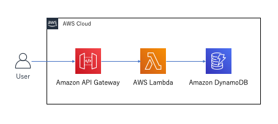
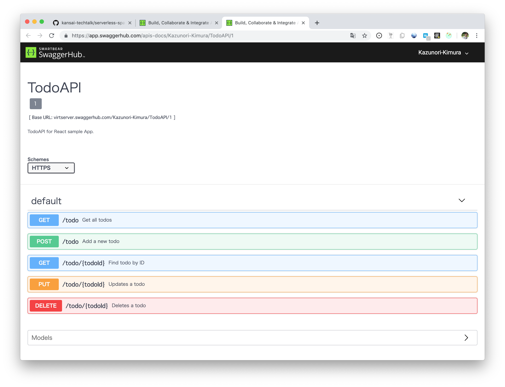
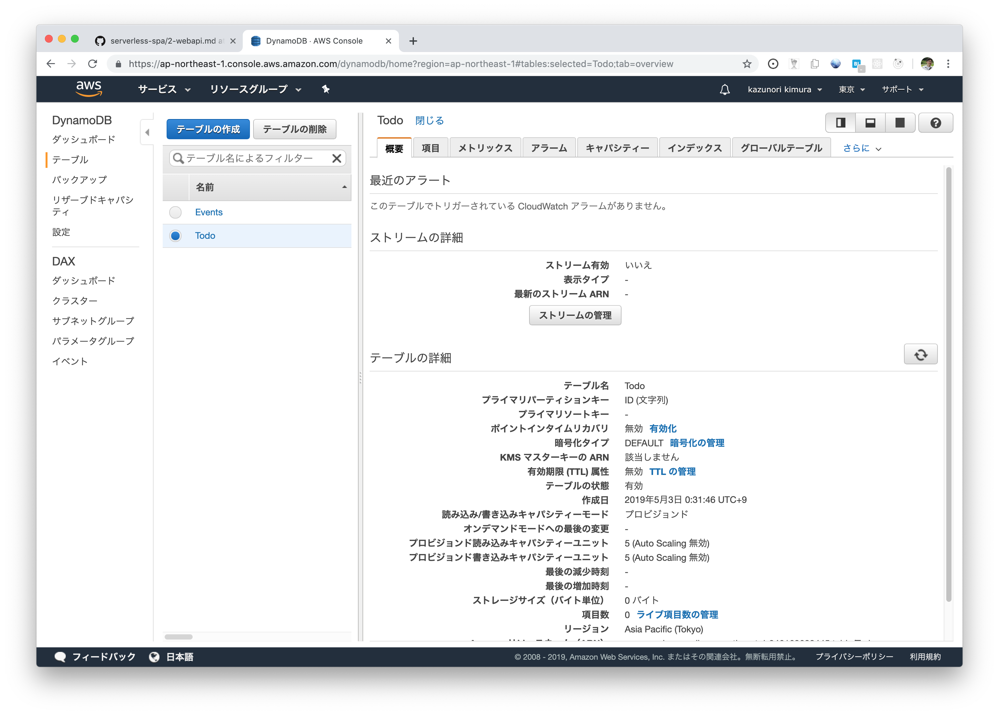
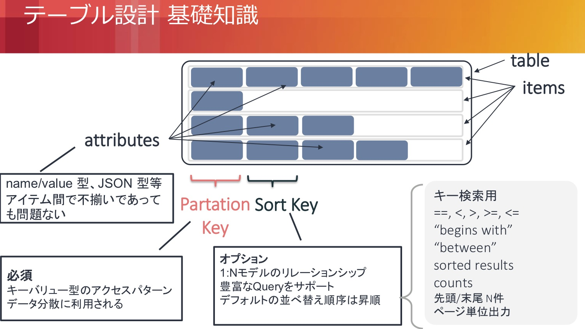
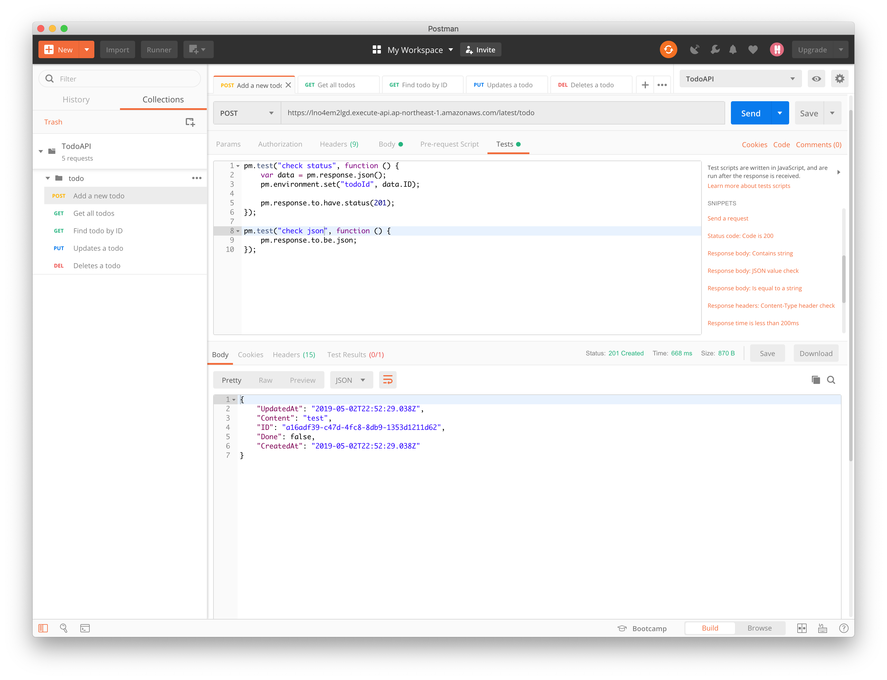

# 2. サーバーレスSPAの構築 - WebAPI編

ToDoアプリのWebAPIを作っていきます

## はじめに



`API Gateway` から直接 `DynamoDB` を参照する構成も可能ですが、今回は汎用性の高い `Lambda` を経由した構成とします。

- [APIGatewayから直接DynamoDBのデータを取得する - Qiita](https://qiita.com/foxtrackjp/items/e286b20943e99e230198)
- [Amazon API Gateway で AWS Service Proxy を使って DynamoDB にアクセスする ｜ DevelopersIO](https://dev.classmethod.jp/cloud/aws/api-gateway-aws-service-proxy-dynamodb/)

## ToDoのデータ設計

- ID
- Content: 内容
- Done: 完了フラグ
- CreatedAt: 作成日時
- UpdatedAt: 更新日時

## API設計

### REST API

Web API のソフトウェアアーキテクチャのスタイルのひとつ。
REST の原則に従っているシステムは *RESTfulなシステム* といわれます。

#### RESTの原則

##### 1. ステートレス なクライアント/サーバープロトコル  

セッションやクッキーによるセッション状態の管理を行わず、一度のリクエスト/レスポンスで問い合わせが完了する。

##### 2. URL でリソースを一意に識別する  

`http://api.example.com/user/1/task/5` のようなURLにリクエストを投げるとuserIdが1のユーザーが持っているtaskIdが5のタスク情報を返すようなイメージ。

##### 3. HTTPメソッドでリソースを操作する

| HTTPメソッド | リソースの操作 |
| --- | --- |
| GET | リソースの取得 (Read) |
| POST | リソースの追加 (Create) |
| PUT | リソースの更新 (Update) |
| DELETE | リソースの削除 (Delete) |

##### 4. 操作の結果は HTTPのステータスコードで返す

| ステータスコード | 意味 |
| --- | --- |
| 200 | OK |
| 201 | Created |
| 204 | No Content |
| 400 | Bad Request |
| 401 | Unauthorized |
| 403 | Forbidden |
| 404 | Not Found |
| 500 | Internal Server Error |

### Swagger

[Swagger](https://swagger.io/) は REST API を設計・実装・テストするためのツール群。

今回作成するAPIの仕様は下記の通り。

https://app.swaggerhub.com/apis/Kazunori-Kimura/TodoAPI/1



## DynamoDBの準備

### DynamoDBとは

 > Amazon DynamoDB は、フルマネージド型の NoSQL データベースサービスで、高速で予測可能なパフォーマンスとシームレスなスケーラビリティを特長としています。
 > 
 > *- [Amazon DynamoDB とは](https://docs.aws.amazon.com/ja_jp/amazondynamodb/latest/developerguide/Introduction.html)*

### Todoテーブルの作成

`Todo` というテーブル名で作成

| フィールド名 | データ型 | Partition Key |
| --- | --- | --- |
| ID | String | ○ |
| Content | String |  |
| Done | Boolean |  |
| CreatedAt | String |  |
| UpdatedAt | String |  |



DynamoDBでは キー以外の属性は任意に設定できるので設定不要



参考: [https://www.slideshare.net/AmazonWebServicesJapan/amazon-dynamodb-advanced-design-pattern](https://www.slideshare.net/AmazonWebServicesJapan/amazon-dynamodb-advanced-design-pattern)

## APIの実装


### API Gatewayとは

> Amazon API Gateway は、あらゆる規模の REST および WebSocket API を作成、公開、保守、モニタリング、および保護するための AWS サービスです。API 開発者は、AWS または他のウェブサービス、AWS クラウドに保存されているデータにアクセスする API を作成できます。API Gateway API 開発者として、独自のクライアントアプリケーション (アプリ) で使用するための API を作成できます。または、API をサードパーティーのアプリ開発者に対して使用可能にできます。
> API Gateway は、以下のような REST API を作成します。
> - HTTP ベース。
> - ステートレスなクライアントサーバー通信を可能にする REST プロトコルに準拠しています。
> - GET、POST、PUT、PATCH、DELETE などの標準の HTTP メソッドを実装しています。
> 
> *- [Amazon API Gateway とは?](https://docs.aws.amazon.com/ja_jp/apigateway/latest/developerguide/welcome.html)*

### Lambdaとは

> AWS Lambda はサーバーをプロビジョニングしたり管理する必要なくコードを実行できるコンピューティングサービスです。 AWS Lambda は必要時にのみてコードを実行し、1 日あたり数個のリクエストから 1 秒あたり数千のリクエストまで自動的にスケーリングします。使用したコンピューティング時間に対してのみお支払いいただきます- コードが実行中でなければ料金はかかりません
> 
> *- [AWS Lambda とは](https://docs.aws.amazon.com/ja_jp/lambda/latest/dg/welcome.html)*

### Claudia.js

> Claudia makes it easy to deploy Node.js projects to AWS Lambda and API Gateway. It automates all the error-prone deployment and configuration tasks, and sets everything up the way JavaScript developers expect out of the box.
> 
> *Google翻訳: Claudiaを使用すると、Node.jsプロジェクトをAWS LambdaとAPI Gatewayに簡単にデプロイできます。エラーが発生しやすいすべてのデプロイメントおよび構成タスクを自動化し、JavaScript開発者がそのまま使用できるようにすべてを設定します。*
> 
> *- [Claudia.js](https://claudiajs.com/)*


> Claudia.jsとは
> AWS上でサーバレスアーキテクチャを実現するためのフレームワークの一つです。同様のフレームワークとしてServerlessやApex等が知られています。
> 
> - Apex: Lambdaにフォーカス。作者のTJがAPI Gatewayをの1st citizenで無いと言っており連携が煩雑。
> - Serverless: YamlにAWSの設定を大量に記述するスタイル。抽象化度合いが低い。
> 
> Claudia.jsはこれらと比較した際に、API Gatewayや外部認証までをも含めたサーバレスアーキテクチャ全体を通して実装するのが簡単です。Node.jsでExpressを用いたAPIサーバを書いていくようなイメージで、設定ファイルを記述していくServerless等と比較して柔軟な処理が行えます。
> 
> *- [Claudia.jsで簡単サーバレスアーキテクチャー - memorandum](http://slowquery.hatenablog.com/entry/2016/12/31/140956)*

#### Claudia.jsのセットアップ

初回はAWSのアカウント設定が必要。
- [Installing and configuring Claudia.js](https://claudiajs.com/tutorials/installing.html)

1. 次の権限を持ったAWSプロファイルを作成: `IAM full access`, `Lambda full access`, `API Gateway Administrator`
2. 作成したAWSプロファイルのアクセスキーを `~/.aws/credentials` に記載します

```
[claudia]
aws_access_key_id = YOUR_ACCESS_KEY
aws_secret_access_key = YOUR_ACCESS_SECRET
```

環境変数 `AWS_PROFILE` に `claudia` を登録しておくと便利です。
（claudiaコマンドの引数でも指定できます）

最後に `Claudia.js` をインストールします。

```sh
$ npm install -g claudia
```

### CRUDの実装

APIに必要なパッケージをインストールします。

```sh
$ npm install --save aws-sdk uuid claudia-api-builder
```

[claudia-api-builder](https://www.npmjs.com/package/claudia-api-builder)
を使って `API Gateway` と `Lambda` の処理を実装していきます。

AWSの各サービス (今回は `DynamoDB`) へのアクセスは [aws-sdk](https://www.npmjs.com/package/aws-sdk) を使用します。

`uuid` はIDの採番に使用します。

#### 共通部分

`index.js` を作成し、APIを実装していきます。

```js
const ApiBuilder = require('claudia-api-builder');
const AWS = require('aws-sdk');
const uuid = require('uuid/v4');

const api = new ApiBuilder();
const dynamoDb = new AWS.DynamoDB.DocumentClient();
// DynamoDBテーブル名
const TableName = 'Todo';
```


#### Create

ToDoの登録処理を作成します。

ユーザーから以下のようなデータがPOSTされてくる想定です。

```json
{
  "Content": "{{string}}"
}
```

DynamoDBの `Todo` テーブルに新しい項目を登録し、登録した項目をJSONの形で返します。

ポイントは日付を `toISOString` メソッドで文字列として保持しているところです。
`Date.prototype.toISOString()` は UTC日時のISO8601形式で表記した文字列を返します。

Localeなどに依らない日時の管理のため、API・DBでは常にUTCで日時を扱い、表示の際にブラウザ等のLocale設定に合わせて表示を行うようにします。

レスポンスのステータスコードは `201 Created` とします。

```js
// POST: /todo
api.post(
  '/todo',
  async (request) => {
    // ID採番
    const ID = uuid();
    // requestからデータを取得
    const Content = request.body.Content;
    // 完了フラグは初期値false
    const Done = false;
    // 作成日時 "2019-05-02T20:42:23.992Z"
    const CreatedAt = (new Date()).toISOString();
    // パラメータ
    const params = {
      TableName,
      Item: {
        ID,
        Content,
        Done,
        CreatedAt,
        UpdatedAt: CreatedAt,
      },
    };

    await dynamoDb.put(params).promise();

    // データ取得
    const res = await dynamoDb.get({
      TableName,
      Key: {
        ID,
      },
    }).promise();

    // responseから項目を取得して返す
    return res.Item;
  },
  {
    success: 201 // response status code: 201 Created
  }
);
```

#### Read (全件取得)

DynamoDBの `scan` によって全件項目を取得します。

レスポンスのステータスコードを指定していませんが、デフォルトでは `200 OK` が返されます。

```js
// GET: /todo
api.get('/todo', () => {
  const params = {
    TableName,
  };

  // 全件取得
  return dynamoDb.scan(params).promise().then((response) => {
    // responseから項目を取得して返す
    return response.Items;
  });
}); // response codeを指定しなければ `200 OK`
```

#### Read (1件取得)

IDを指定して1件だけ取得する処理です。

URLに指定されたIDを取得し、DynamoDBを検索しています。

```js
// GET: /todo/{id}
api.get('/todo/{id}', (request) => {
  // ID取得
  const ID = request.pathParams.id;
  const params = {
    TableName,
    // プライマリーキーで一つ指定
    Key: {
      ID,
    },
  };

  return dynamoDb.get(params).promise().then((response) => {
    // responseから項目を取得して返す
    return response.Item;
  });
});
```

#### Update

更新処理は少し特殊です。

```js
// PUT: /todo/{id}
api.put('/todo/{id}', async (request) => {
  // ID取得
  const ID = request.pathParams.id;
  // requestからデータを取得
  const { Content, Done } = request.body;
  // 更新日時 "2019-05-02T20:42:23.992Z"
  const UpdatedAt = (new Date()).toISOString();
  // パラメータ
  const params = {
    TableName,
    // 更新する項目のキーを指定
    Key: {
      ID,
    },
    // 更新式の定義
    // - ステップ 3: 項目を作成、読み込み、更新、削除する
    //   (https://docs.aws.amazon.com/ja_jp/amazondynamodb/latest/developerguide/GettingStarted.NodeJs.03.html)
    UpdateExpression: 'SET Content = :c, Done = :d, UpdatedAt = :u',
    // valueの指定
    ExpressionAttributeValues: {
      ':c': Content,
      ':d': Done,
      ':u': UpdatedAt,
    },
  };

  // put: 新しい項目を作成します。同じキーを持つ項目がテーブルにすでに存在する場合は、新しい項目に置き換えられます。
  // update: 指定されたキーを持つ項目が存在しない場合は、新しい項目が作成されます。または、既存の項目の属性が変更されます。
  await dynamoDb.update(params).promise();

  const response = await dynamoDb.get({
    TableName,
    Key: {
      ID,
    },
  }).promise();

  return response.Item;
});
```

#### Delete

Deleteでは特にレスポンスのボディに値をセットしません。

```js
// DELETE: /todo/{id}
api.delete('/todo/{id}', (request) => {
  // ID取得
  const ID = request.pathParams.id;
  // パラメータ
  const params = {
    TableName,
    Key: {
      ID,
    },
  };

  return dynamoDb.delete(params).promise().then(() => {
    // 204 No Content
    return new ApiBuilder.ApiResponse('OK', { 'Content-Type': 'text/plain' }, 204);
  });
});

module.exports = api;
```

#### 参考:

example-projects/index.js at master · claudiajs/example-projects
https://github.com/claudiajs/example-projects/blob/master/dynamodb-example/index.js

#### DynamoDBへのアクセス権限設定

`policies/access-dynamodb.json` を作成、以下のようにアクセス権限を設定します。

```json
{
  "Version": "2012-10-17",
  "Statement": [
    {
      "Action": [
        "dynamodb:DeleteItem",
        "dynamodb:GetItem",
        "dynamodb:PutItem",
        "dynamodb:UpdateItem",
        "dynamodb:Scan"
      ],
      "Effect": "Allow",
      "Resource": "*"
    }
  ]
}
```


### デプロイ

以下のコマンドで `API Gateway` と `Lambda` に展開します。

```sh
$ claudia create --region ap-northeast-1 --api-module index --policies policies --configure-db --profile claudia
```

`claudia.json` が生成されます。

以降、APIの更新は以下のコマンドを実行します。

```sh
$ claudia update
```

## 動作確認

### POSTMAN

> Postman makes API development easy. We provide all the tools you need to manage every stage of the API lifecycle on our simple UI. You can design and mock, debug, test, document, monitor, and publish your APIs - all from one place.
> 
> PostmanはAPI開発を容易にします。シンプルなUIで、APIライフサイクルのあらゆる段階を管理するために必要なすべてのツールを提供しています。 APIを設計し、モック、デバッグ、テスト、文書化、監視、および公開することができます。これらはすべて1か所から行えます。
> 
> *- [Postman](https://www.getpostman.com)*



- swaggerからYAMLをExportしPostmanにImport
- パラメータなどを定義
  - POST
  - GET
  - GET ALL
  - UPDATE
  - DELETE


Test scripts | Postman Learning Center
https://learning.getpostman.com/docs/postman/scripts/test_scripts/
