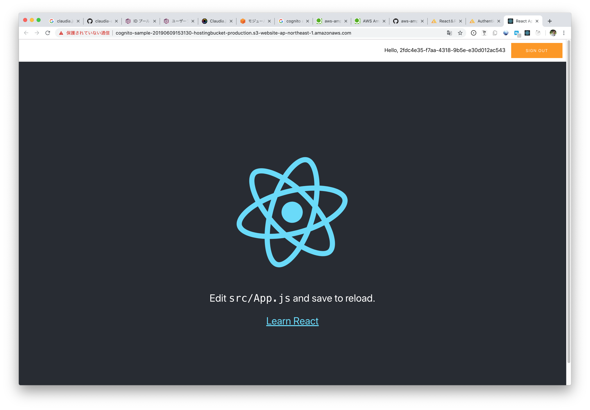

# 3. サーバーレスSPAの構築 ~SPA編~

## Amazon Cognitoとは

> Amazon Cognito は、ウェブアプリケーションやモバイルアプリケーションの認証、許可、ユーザー管理をサポートしています。ユーザーは、ユーザー名とパスワードを使用して直接サインインするか、Facebook、Amazon、Google などのサードパーティーを通じてサインインできます。
> 
> *[Amazon Cognito とは - Amazon Cognito](https://docs.aws.amazon.com/ja_jp/cognito/latest/developerguide/what-is-amazon-cognito.html)*


## aws-amplify

> Amplify your apps. Build on a flexible, scalable, and reliable serverless backend.
> 
> *[The foundation for your cloud-powered mobile & web apps](https://aws-amplify.github.io/)*

Amazon S3やCloudFront, Cognitoの構築をサポートするコマンドラインインターフェースと各プラットフォーム向けのライブラリが用意されている

https://aws-amplify.github.io/docs/

### コマンドライン インターフェースのインストール

```sh
$ npm install -g @aws-amplify/cli
$ amplify configure
Follow these steps to set up access to your AWS account:

Sign in to your AWS administrator account:
https://console.aws.amazon.com/
Press Enter to continue

Specify the AWS Region
? region:  ap-northeast-1
Specify the username of the new IAM user:
? user name:  amplify-user
```

IAMユーザーの登録画面が表示されるので、そのまま進める  
アクセスキーとシークレットキーが表示される

```sh
Complete the user creation using the AWS console
https://console.aws.amazon.com/iam/home?region=undefined#/users$new?step=final&a
ccessKey&userNames=amplify-user&permissionType=policies&policies=arn:aws:iam::aw
s:policy%2FAdministratorAccess
Press Enter to continue

Enter the access key of the newly created user:
? accessKeyId:  AKIAVBGHHO**********
? secretAccessKey:  pdt8Su37FlXHH7X/wRZz********************
This would update/create the AWS Profile in your local machine
? Profile Name:  amplify

Successfully set up the new user.
```

## SPAの作成

[React & React Native](https://aws-amplify.github.io/docs/js/react)

### React & amplifyの導入

`React` のアプリケーションを作成する

```sh
$ npm install -g create-react-app
$ create-react-app app
$ cd app
```

つづいて `amplify` の初期化処理

```sh
$ amplify init
Note: It is recommended to run this command from the root of your app directory
? Enter a name for the project cognito-sample
? Enter a name for the environment production
? Choose your default editor: Visual Studio Code
? Choose the type of app that you're building javascript
Please tell us about your project
? What javascript framework are you using react
? Source Directory Path:  src
? Distribution Directory Path: build
? Build Command:  npm run-script build
? Start Command: npm run-script start
Using default provider  awscloudformation

For more information on AWS Profiles, see:
https://docs.aws.amazon.com/cli/latest/userguide/cli-multiple-profiles.html

? Do you want to use an AWS profile? Yes
? Please choose the profile you want to use amplify

✔ Successfully created initial AWS cloud resources for deployments.
✔ Initialized provider successfully.
Initialized your environment successfully.

Your project has been successfully initialized and connected to the cloud!
```

S3へのホストを行う

```sh
$ amplify add hosting
```

> You would be prompted next to select the environment setup. Select DEV (S3 only with HTTP) for quick prototyping and testing, and once production ready you could run the amplify update hosting command to publish your app to Amazon CloudFront (a CDN service).
> 
> 【訳】次に環境設定を選択するように指示されます。素早いプロトタイピングとテストを行うにはDEV（HTTPのみS3）を選択し、プロダクションの準備ができたら、Amplify update hostingコマンドを実行してアプリをAmazon CloudFront（CDNサービス）に公開できます。

そのまま `publish` を行う

```sh
$ amplify publish
```

アプリが S3 にアップロードされてデフォルトブラウザで表示される

### Cognitoのセットアップ

```ssh
$ amplify add auth
Using service: Cognito, provided by: awscloudformation
 
 The current configured provider is Amazon Cognito. 
 
 Do you want to use the default authentication and security configuration? Defau
lt configuration
 Warning: you will not be able to edit these selections. 
 How do you want users to be able to sign in when using your Cognito User Pool? 
Email

 Warning: you will not be able to edit these selections. 
 What attributes are required for signing up? (Press <space> to select, <a> to t
oggle all, <i> to invert selection)
Email

Successfully added resource cognitosamplebed19e0d locally

Some next steps:
"amplify push" will build all your local backend resources and provision it in t
he cloud
"amplify publish" will build all your local backend and frontend resources (if y
ou have hosting category added) and provision it in the cloud
$ amplify push
~~ 略 ~~
✔ All resources are updated in the cloud
```

amplifyのライブラリのインストール

```sh
npm install --save aws-amplify aws-amplify-react
```

`./src/App.js` を更新

```js
import Amplify from 'aws-amplify';
import awsconfig from './aws-exports';
import { withAuthenticator } from 'aws-amplify-react'; // or 'aws-amplify-react-native';

Amplify.configure(awsconfig);

// ~~~ 略 ~~~

export default withAuthenticator(App, true);
```

`publish` して動作確認

```sh
$ amplify publish
```

Reactアプリに認証機能が実装される



## APIの認証設定

### APIの修正

Reactアプリで認証した場合のみAPIが応答を返すように設定する

`Claudia.js` で認証機能を設定する

各APIの末尾に以下のパラメータを追加

```js
{ authorizationType: 'AWS_IAM' }
```

AWSに反映させる

```sh
$ claudia update --profile claudia
```

### IAMロール設定

- AWSコンソールで `マイセキュリティ資格情報` -> ロールを選択
- `cognito-sample-production-20190609152633-authRole` を選択
- ポリシーを作成
  - `ExecuteAPI`
  - ひとまずリソースは何でもOKにする

### 動作確認

リクエストに失敗することを確認する

## Reactアプリの改修

ボタンが押された際にリクエストが成功することを確認する

```js
import React, { Component } from 'react';
import Amplify, { API } from 'aws-amplify';
import { withAuthenticator } from 'aws-amplify-react';
import Todo from './Components/Todo';

import './App.css';

Amplify.configure({
  Auth: {
      // REQUIRED - Amazon Cognito Identity Pool ID
      identityPoolId: 'ap-northeast-1:f67e92ad-1612-4ff6-8ffe-6479e3ac6fff',
      // REQUIRED - Amazon Cognito Region
      region: 'ap-northeast-1', 
      // OPTIONAL - Amazon Cognito User Pool ID
      userPoolId: 'ap-northeast-1_dGAsJfaAZ', 
      // OPTIONAL - Amazon Cognito Web Client ID (26-char alphanumeric string)
      userPoolWebClientId: '383nhdifpim9cidb8k11slg8a5',
  },
  API: {
    endpoints: [
      {
        name: 'api',
        endpoint: 'https://lno4em2lgd.execute-api.ap-northeast-1.amazonaws.com/latest',
        region: 'ap-northeast-1'
      }
    ]
  }
});

class App extends Component {
  handleClick = () => {
    API.get('api', '/todo').then((res) => {
      console.log(res);

      this.setState({
        todos: [...res],
      });
    }).catch (error => {
      console.log(error);
    });
  }

  render() {
    return (
      <div className="App">
        <button type="button" onClick={this.handleClick}>OK</button>
      </div>
    );
  }
}

export default withAuthenticator(App, true);
```

`publish` して動作確認

```sh
$ amplify publish
```

ボタンをクリックし、コンソールにTodoのリストが表示されることを確認する

------

## 参考

- https://github.com/aws-amplify/amplify-js
- https://aws-amplify.github.io/docs/
- https://qiita.com/yuku_t/items/86fcb5a903901e6ba91d
