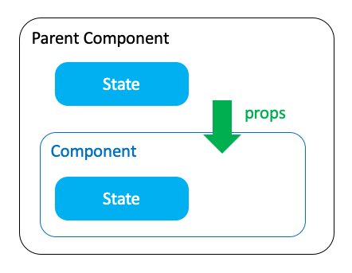

# 4. サーバーレスSPAの構築 -SPA編-

見た目を整理してアプリケーションっぽくする

## Reactとは

> ユーザインターフェース構築のための JavaScript ライブラリ
>
> *[React](https://ja.reactjs.org/)*



## 実装デモ

### ライブラリの追加

以下のライブラリを追加する

```sh
$ npm install --save classnames prop-types
```

classnames: 動的にclassの指定を組み立てられる
prop-types: props の型チェックを行う

> PropTypes は受け取ったデータが有効かどうかを確認するために使用できる種々のバリデーターをエクスポートしています。上記の例では、PropTypes.string を使用しています。無効な値がプロパティに与えられた場合、JavaScript のコンソールに警告文が出力されます。パフォーマンス上の理由から、propTypes のチェックは開発モードでのみ行われます。
> 
> [PropTypes を用いた型チェック – React](https://ja.reactjs.org/docs/typechecking-with-proptypes.html)


### Todoコンポーネントの作成

`components/Todo.js`

ひとつのTodoを表示・編集するコンポーネントを作成する

```js
import React, { Component, Fragment } from 'react';
import PropTypes from 'prop-types';
import classnames from 'classnames';

import './Todo.css';

class Todo extends Component {
  state = {
    Content: '',
    Done: false,
  };

  componentWillMount() {
    const { Content, Done } = this.props;
    this.setState({
      Content,
      Done,
    });
  }

  componentWillReceiveProps(nextProps) {
    const {
      Content,
      Done,
    } = nextProps;

    this.setState({
      Content,
      Done,
    });
  }

  /**
   * テキストエリアの変更
   */
  handleChange = (e) => {
    const { name, value } = e.target;
    this.setState({ [name]: value });
  };

  /**
   * チェックボックスの変更
   */
  handleCheck = (e) => {
    const { name, checked } = e.target;
    const { ID, Content, onUpdate, edit } = this.props;

    if (edit) {
      // editモードの場合はstateを更新
      this.setState({ [name]: checked });
    } else {
      // editモードでなければ即時反映
      onUpdate({ ID, Content, Done: checked });
    }
  };

  /**
   * Editボタンのクリック
   */
  handleClickEdit = () => {
    const { ID, onEdit } = this.props;
    // Editモードに切り替え
    onEdit(ID);
  };

  /**
   * Deleteボタンのクリック
   */
  handleClickDelete = () => {
    const { ID, onDelete } = this.props;
    onDelete(ID);
  };

  /**
   * Cancelボタンのクリック
   */
  handleClickCancel = () => {
    const { onEdit } = this.props;
    // Editモードをキャンセル
    onEdit(false);
  };

  /**
   * OKボタンのクリック
   */
  handleClickOK = () => {
    const { ID, onUpdate } = this.props;
    const { Content, Done } = this.state;

    onUpdate({ ID, Content, Done });
  };

  render() {
    const {
      ID,
      CreatedAt,
      UpdatedAt,
      edit,
    } = this.props;

    const {
      Content,
      Done,
    } = this.state;

    return (
      <div className={classnames({
        Todo: true,
        Done,
        edit,
      })}>
        <label className="checkbox">
          <input
            type="checkbox"
            name="Done"
            checked={Done}
            onChange={this.handleCheck}
          />
          Done
        </label>
        <div className="main">
          <div className="header">
            <div className="id">{ID}</div>
            <div className="date">CreatedAt: {CreatedAt}</div>
            <div className="date">UpdatedAt: {UpdatedAt}</div>
          </div>
          {edit ? (
            <textarea
              className="content"
              name="Content"
              value={Content}
              onChange={this.handleChange}
            />
          ) : (
            <div className="content">{Content}</div>
          )}
        </div>
        <div className="actions">
          {edit ? (
            <Fragment>
              <button type="button" onClick={this.handleClickCancel}>Cancel</button>
              <button type="button" onClick={this.handleClickOK}>OK</button>
            </Fragment>
          ) : (
            <Fragment>
              <button type="button" onClick={this.handleClickEdit}>Edit</button>
              <button type="button" onClick={this.handleClickDelete}>Delete</button>
            </Fragment>
          )}
        </div>
      </div>
    );
  }
}

Todo.defaultProps = {
  edit: false,
};

Todo.propTypes = {
  ID: PropTypes.string.isRequired,
  Content: PropTypes.string.isRequired,
  Done: PropTypes.bool.isRequired,
  CreatedAt: PropTypes.string.isRequired,
  UpdatedAt: PropTypes.string.isRequired,
  edit: PropTypes.bool,
  onUpdate: PropTypes.func.isRequired,
  onDelete: PropTypes.func.isRequired,
  onEdit: PropTypes.func.isRequired,
};

export default Todo;

```

`components/Todo.css`

```css
.Todo {
  display: flex;
  flex-direction: row;
  justify-content: flex-start;
  align-items: center;
  width: 900px;
  padding: 16px;
}

.checkbox {
  width: 100px;
  flex-direction: row;
  justify-content: center;
  align-items: center;
}

.main {
  flex: 1;
  display: flex;
  flex-direction: column;
  justify-content: flex-start;
  align-items: stretch;
}

.header {
  display: flex;
  flex-direction: row;
  justify-content: flex-start;
  align-items: flex-start;

  font-size: x-small;
  color: #999999;
}

div.content {
  flex: 1;
  text-align: left;

  font-size: large;
  color: #333333;
}

.actions {
  display: flex;
  flex-direction: column;
  justify-content: center;
  align-items: center;
  width: 140px;
}

.actions button {
  width: 120px;
}

.Done {
  background-color: #cccccc;
}

.edit {
  background-color: #d4d8fd;
}
```

`App.js`

- APIの呼び出し処理を実装
- 登録フォームの実装
- Todoコンポーネントを一覧表示

```js
import React, { Component } from 'react';
import Amplify, { API } from 'aws-amplify';
import { withAuthenticator } from 'aws-amplify-react';
import Todo from './components/Todo';

import './App.css';

Amplify.configure({
  Auth: {
    identityPoolId: 'ap-northeast-1:7a1e09c7-282a-44a3-be49-bac7933106f9',
    region: 'ap-northeast-1',
    userPoolId: 'ap-northeast-1_KpjCfGb4O',
    userPoolWebClientId: '7nocohtf7auj70j7dumuqdpj3o',
  },
  API: {
    endpoints: [
      {
        name: 'api',
        endpoint: 'https://lno4em2lgd.execute-api.ap-northeast-1.amazonaws.com/latest',
        region: 'ap-northeast-1',
      }
    ]
  }
});

class App extends Component {
  state = {
    todos: [],
    Content: '',
  };

  componentDidMount() {
    this.getTodoAsync().then((res) => {
      console.log(res);
    }).catch (error => {
      console.log(error);
    });
  }

  /**
   * 取得処理
   */
  getTodoAsync = async () => {
    try {
      const res = await API.get('api', '/todo');
      console.log(res);

      this.setState({
        todos: [...res.sort((a, b) => a.CreatedAt < b.CreatedAt ? 1 : -1)],
      });
    } catch (err) {
      console.error(err);
    }
  };

  /**
   * 登録処理
   */
  createTodoAsync = async (body) => {
    try {
      // 登録処理
      const res = await API.post('api', '/todo', { body });
      console.log(res);

      // 取得処理
      await this.getTodoAsync();
    } catch (err) {
      console.error(err);
    }
  };

  /**
   * 更新処理
   */
  updateTodoAsync = async (body) => {
    try {
      // 更新処理
      const path = `/todo/${body.ID}`;
      const res = await API.put('api', path, { body });
      console.log(res);

      // 取得処理
      await this.getTodoAsync();
    } catch (err) {
      console.error(err);
    }
  };

  /**
   * 削除処理
   */
  deleteTodoAsync = async (ID) => {
    try {
      // 削除処理
      const path = `/todo/${ID}`;
      const res = await API.del('api', path);
      console.log(res);

      // 取得処理
      await this.getTodoAsync();
    } catch (err) {
      console.error(err);
    }
  };

  /**
   * 編集
   */
  handleEdit = (id) => {
    const { todos } = this.state;

    const newTodos = todos.map((item) => {
      item.edit = item.ID === id;
      return item;
    });

    this.setState({
      todos: newTodos,
    });
  };

  /**
   * テキストエリア変更
   */
  handleChenge = (e) => {
    const { name, value } = e.target;
    this.setState({ [name]: value });
  };

  /**
   * 追加
   */
  handleClickAdd = () => {
    const { Content } = this.state;
    if (Content) {
      this.createTodoAsync({ Content, Done: false }).then(() => {
        this.setState({
          Content: '',
        });
      });
    }
  };

  /**
   * 更新
   */
  handleUpdate = (params) => {
    this.updateTodoAsync(params);
  };

  /**
   * 削除
   */
  handleDelete = (ID) => {
    this.deleteTodoAsync(ID);
  };

  /**
   * テキストエリアのクリア
   */
  handleClickClear = () => {
    this.setState({
      Content: '',
    });
  };

  render() {
    const { todos, Content } = this.state;

    return (
      <div className="App">
        <div className="form">
          {/* 新規登録フォーム */}
          <textarea
            name="Content"
            className="text"
            value={Content}
            onChange={this.handleChenge}
          />
          <div className="actions">
            <button
              type="button"
              disabled={!Content}
              onClick={this.handleClickAdd}
            >
              登録
            </button>
            <button
              type="button"
              onClick={this.handleClickClear}
            >
              クリア
            </button>
          </div>
        </div>
        {/* Todoのリスト */}
        {todos && todos.map((todo) => (
          <Todo
            key={todo.ID}
            onEdit={this.handleEdit}
            onUpdate={this.handleUpdate}
            onDelete={this.handleDelete}
            {...todo}
          />
        ))}
      </div>
    );
  }
}

export default withAuthenticator(App, true);
```

`App.css`

```css
.App {
  display: flex;
  flex-direction: column;
  align-items: center;
  justify-content: center;
}

.form {
  display: flex;
  flex-direction: row;
  justify-content: flex-start;
  align-items: center;
  width: 900px;
  margin: 10px;
}

.text {
  flex: 1;
  height: 60px;
}

.actions {
  width: 100px;
  padding: 10px;
  display: flex;
  flex-direction: column;
  justify-content: center;
  align-items: center;
}

.actions button {
  width: 80px;
}
```

### 動作確認

```sh
$ npm start
```

### アップロード

```sh
$ amplify publish
```
